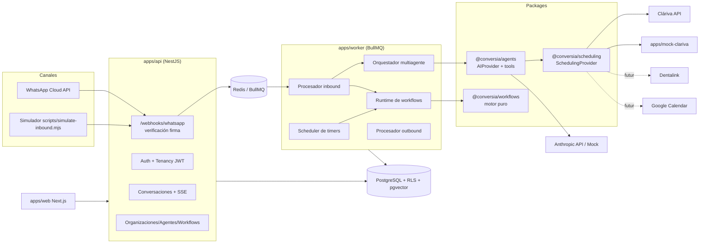
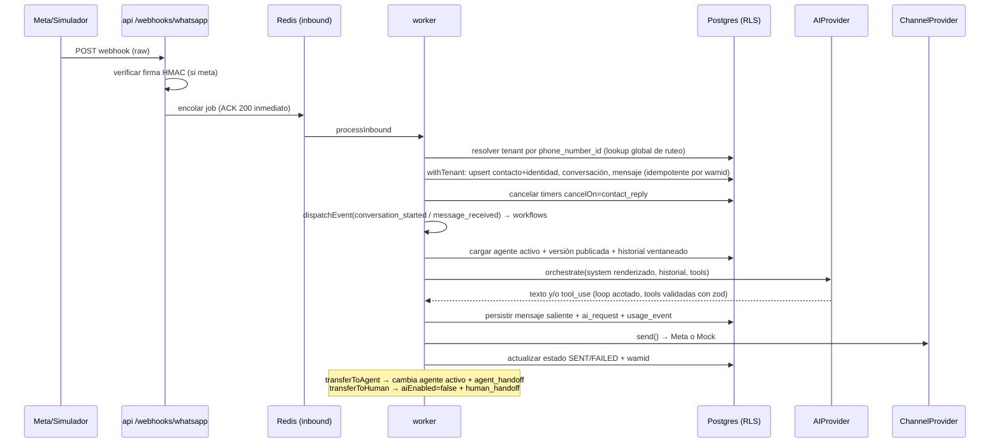
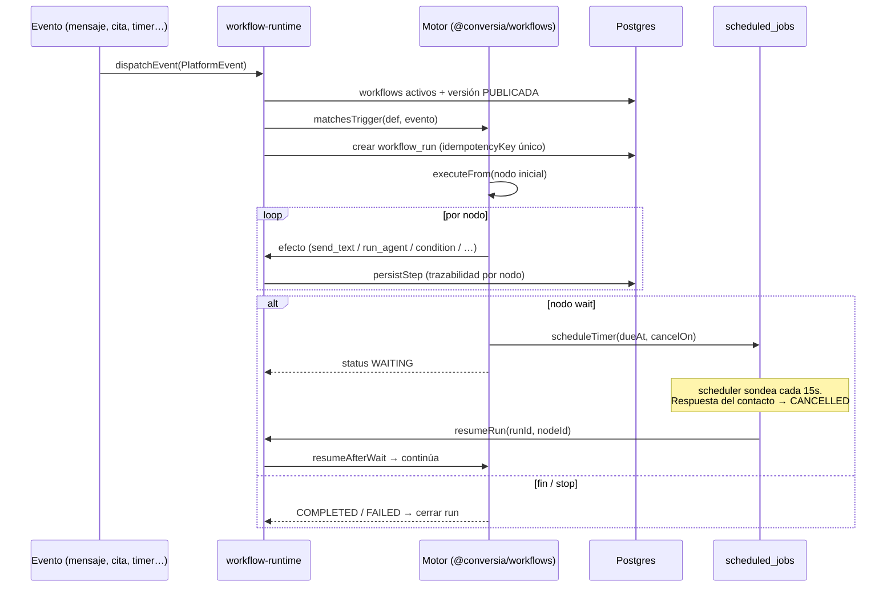

# Arquitectura

## Visión

SaaS multi-tenant de atención conversacional: WhatsApp → agentes de IA configurables → workflows → agendamiento vía proveedores externos. Un solo despliegue sirve a N organizaciones con aislamiento estricto (ver [MULTITENANCY.md](MULTITENANCY.md)).

## Diagrama general

## Stack

| Capa | Elección | Motivo |
|---|---|---|
| Frontend | Next.js 15 + React 19 + Tailwind 4 | Estándar, SSR/CSR flexible, el equipo ya usa Next (Cláriva) |
| Backend API | NestJS 11 + TypeScript | Módulos, DI, middleware; validación con zod |
| Worker | Node + BullMQ (sin Nest) | Procesos de cola simples, arranque rápido |
| BD | PostgreSQL 16 + pgvector | RLS nativo para tenancy, vectores para RAG |
| ORM | Prisma 6 | Productividad + migraciones; RLS vía `withTenant` |
| Colas | BullMQ + Redis | Suficiente para MVP (ver ADR-3 en DECISIONS.md) |
| Timers | Tabla `scheduled_jobs` en Postgres | Esperas de días sobreviven reinicios de Redis |
| IA | Capa `AIProvider` (Anthropic primero) | Multi-proveedor desde el día 1; Mock para dev |
| Monorepo | pnpm workspaces + Turborepo | Builds incrementales, paquetes compartidos |
| Hosting MVP | Railway (Postgres+Redis+3 servicios) | Ya usado por el equipo; migración documentada en DEPLOYMENT.md |

## Flujo de un mensaje entrante

## Flujo de una ejecución de workflow

## Decisiones estructurales

Registradas como ADRs en [DECISIONS.md](DECISIONS.md). Las más importantes:

1. **RLS con esquema compartido** (no BD-por-tenant): miles de tenants pequeños, workflows/colas compartidos. Escape hatch: tenants premium a BD dedicada reutilizando el mismo schema Prisma.
2. **BullMQ + timers en Postgres** en lugar de Temporal para el MVP.
3. **Grafo de workflow serializado en JSON versionado** (no tablas nodo/arista) — es el formato natural del editor visual.
4. **Worker sin NestJS**: menos capas donde no aportan.
5. **SSE con sondeo** para tiempo real v0; upgrade a Redis pub/sub + WebSockets planificado.

## Estructura del monorepo

Ver árbol en [../README.md](../README.md). Diferencias justificadas frente a la propuesta original del brief: `webhook-gateway` está integrado en `apps/api` (separarlo solo cuando el volumen lo exija); `packages/{auth,security,observability,knowledge,ui,testing}` se extraerán cuando su contenido crezca — hoy viven dentro de api/worker/agents para evitar paquetes vacíos.
