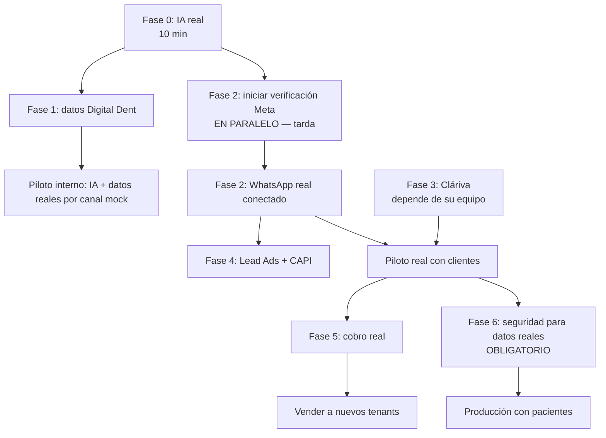

# Puesta en marcha — checklist para conectar todo

Guía paso a paso desde el estado actual (todo desplegado en Railway pero con
proveedores en **mock**) hasta una plataforma operativa con datos reales.
Marca cada ítem al completarlo. Leyenda de responsable: 🧑 tú · 🤖 Claude (puedo
hacerlo yo con tus credenciales/decisión) · 🔗 tercero (Meta/Cláriva/pasarela).

Estado global hoy: API, worker, panel, Postgres (RLS) y Redis en Railway ·
aislamiento multi-tenant verificado · panel de plataforma + billing (manual/mock)
· IA/WhatsApp/agenda/pagos en **mock**.

---

## Fase 0 — Encender la IA (lo más rápido y visible) · ~10 min

Desbloquea que los agentes respondan de verdad. No depende de nadie externo.

- [ ] 🧑 Conseguir una **API key de Anthropic** (console.anthropic.com).
- [ ] 🤖 Setear en Railway (servicios **api** y **worker**):
  ```
  railway variables --set "AI_PROVIDER=anthropic" --set "ANTHROPIC_API_KEY=sk-ant-..." --service api
  railway variables --set "AI_PROVIDER=anthropic" --set "ANTHROPIC_API_KEY=sk-ant-..." --service worker
  ```
- [ ] 🤖 Probar una conversación real por el simulador o el panel; verificar respuesta del agente y costo en Reportes.
- [ ] 🧑 Revisar/afinar los prompts de los agentes de Digital Dent en `/agents`.

> Con esto Digital Dent ya conversa con IA real (aún por canal mock).

---

## Fase 1 — Datos reales de Digital Dent · ~1-2 h

Para que la IA hable con información verdadera (no placeholders).

- [ ] 🧑 Cargar **servicios reales** con precios (`/agents` usa la BD; editar en `packages/database/seeds/digital-dent.json` y re-seed, o crear panel de servicios — pendiente).
- [ ] 🧑 **Profesionales** reales y qué prestación atiende cada uno.
- [ ] 🧑 **FAQ / base de conocimiento** real (formas de pago, convenios, dirección, política de cancelación).
- [ ] 🧑 Ajustar **horarios y reglas** de agendamiento.

> Pendiente de construir: panel CRUD de servicios/profesionales/KB (hoy se cargan por seed JSON). 🤖 lo puedo hacer.

---

## Fase 2 — WhatsApp real (CAMINO CRÍTICO — empezar YA, tarda por Meta) · días-semanas

La verificación de negocio en Meta demora; iniciarla temprano en paralelo.

- [ ] 🧑 Crear **Meta Business Manager** + **App** (developers.facebook.com) con el producto WhatsApp.
- [ ] 🔗 **Verificación de negocio** en Meta (documentos de la empresa) — puede tardar días.
- [ ] 🧑 Agregar y verificar el **número de WhatsApp** (no puede tener WhatsApp normal activo).
- [ ] 🧑 Generar **token de usuario de sistema** permanente + copiar `phone_number_id`, `WABA id`, `app secret`.
- [ ] 🧑 En el panel **Canales → Conectar canal → WhatsApp Cloud**: pegar esos datos (el token se guarda cifrado).
- [ ] 🧑 En Meta → WhatsApp → Configuration, registrar el **webhook** con la URL y el verify token que muestra la página Canales; suscribir el campo `messages`.
- [ ] 🤖 Setear en Railway: `WHATSAPP_PROVIDER=meta`, `META_APP_SECRET`, `META_ACCESS_TOKEN`, `META_VERIFY_TOKEN` (el mismo del panel).
- [ ] 🧑 Probar con un mensaje real desde otro teléfono; verificar en la Bandeja.
- [ ] 🔗 Cumplir la **política de IA de Meta (ene-2026)**: bots de propósito acotado (atención/reservas), no asistente general. Nuestro diseño ya cumple.
- [ ] 🤖 (Después) **Plantillas de WhatsApp** para escribir fuera de la ventana de 24 h — pendiente de construir la sincronización de plantillas.

> Plan B si el onboarding directo es fricción: adaptador Twilio/360dialog (la capa `ChannelProvider` ya está lista, ~1 día). Meta directo = sin markup.

---

## Fase 3 — Agenda real (Cláriva u otro) · depende de Cláriva

- [ ] 🔗 **Cláriva implementa el contrato** de `docs/CLARIVA.md` (endpoints REST + webhooks firmados). Enviar ese doc a su equipo.
- [ ] 🧑 En **Integraciones → Cláriva**: cargar URL + API key (se cifra) y "Probar conexión" (lista las sedes).
- [ ] 🤖 Construir **mapeo de profesionales/prestaciones** (id de Cláriva ↔ interno) — pendiente.
- [ ] 🤖 Construir **receptor de webhooks de Cláriva** (`/webhooks/clariva`) para estados de citas — pendiente.
- [ ] 🧑 Probar: consultar disponibilidad y crear una cita de prueba end-to-end.

> Alternativa mientras Cláriva no esté: Google Calendar o el mock. La capa `SchedulingProvider` permite conectar cualquiera.

---

## Fase 4 — Marketing: Lead Ads + Conversions API · requiere Meta (Fase 2)

- [ ] 🧑 En **Integraciones → Meta Business Suite**, completar el wizard (conectar, activos, funciones).
- [ ] 🧑 **Lead Ads**: suscribir formularios, revisar el **mapeo de campos** (ya hay UI), probar un lead real → aparece en Contactos y dispara workflows.
- [ ] 🧑 **Conversions API**: cargar el **dataset id** y (en pruebas) el `test_event_code`; definir las **reglas evento→evento** (ya hay UI); enviar una conversión real.
- [ ] 🧑 Verificar en Meta Events Manager que llegan los eventos.

---

## Fase 5 — Cobro real (billing) · decisión de pasarela pendiente

- [ ] 🧑 **DECISIÓN**: pasarela. USD → **Stripe** (requiere entidad/LLC) o **Paddle/Lemon Squeezy** (Merchant of Record, sin entidad). CLP local → **Flow** o **Transbank Webpay**.
- [ ] 🤖 Implementar el **adaptador real** (`StripePaymentProvider`): crear productos/precios espejo de los 4 planes, `createCheckout` → Stripe Checkout Session.
- [ ] 🤖 **Webhook receiver** de la pasarela (`checkout.session.completed`, `invoice.paid`, `subscription.updated`) firmado → activa/renueva la suscripción y sincroniza facturas.
- [ ] 🤖 Setear `STRIPE_SECRET_KEY` + `STRIPE_WEBHOOK_SECRET` (el mock se desactiva solo en prod).
- [ ] 🤖 **Enforcement duro de límites**: bloquear crear agentes/canales/usuarios al exceder el plan (hoy la IA sí se corta por plan; el resto es solo visual).
- [ ] 🧑 **Boletas/IVA** (Chile, SII) y numeración fiscal — pendiente.

---

## Fase 6 — Seguridad para producción con datos reales · OBLIGATORIO antes de pacientes

Ver `docs/SECURITY_ROADMAP.md` (30/60/90). Lo mínimo antes de datos clínicos reales:

- [ ] 🤖 **MFA (TOTP)** para el super-admin de plataforma y para admins de tenant.
- [ ] 🧑+🤖 **Prueba de restauración de backups** (definir RPO/RTO, restaurar a un entorno efímero).
- [ ] 🧑 **Cloudflare** (o WAF) delante del panel y la API: rate limit por IP, ocultar el origen.
- [ ] 🤖 Confirmar que api/worker conectan con el **rol `conversia_app`** (RLS) — ya seteado; verificar tras el próximo deploy.
- [ ] 🧑 **Contratos de tratamiento de datos** con Anthropic, OpenAI y Meta (DPA).
- [ ] 🤖 **Capa de política de datos a IA** (campos permitidos/prohibidos por tenant, redacción).
- [ ] 🧑 **Pentest externo** independiente.
- [ ] 🧑 Revisión legal de la **Ley 21.719** (protección de datos, datos de salud).

---

## Fase 7 — Crecer y pulir · cuando ya opere

- [ ] 🤖 **Audios entrantes**: descarga de media de WhatsApp + transcripción con **OpenAI** (`gpt-4o-mini-transcribe`, ~US$0.003/min). Requiere `OPENAI_API_KEY`. La API de Claude no acepta audio.
- [ ] 🤖 **Imágenes/documentos** entrantes + pipeline de cuarentena/antimalware (hoy no hay carga de archivos).
- [ ] 🤖 **Editor visual de workflows** (drag & drop sobre el formato JSON ya existente).
- [ ] 🤖 **Onboarding self-service** de nuevos tenants (registro ya existe; falta el wizard de configuración guiada).
- [ ] 🤖 **Monitoreo/alertas** operativas + Centro de seguridad en `/admin`.
- [ ] 🤖 **White-label** por tenant (logo, colores, subdominio — campos ya en el modelo).
- [ ] 🤖 CRUD de servicios/profesionales/KB en panel (reemplazar seeds JSON).

---

## Ruta recomendada (orden real de ejecución)



**En una frase**: enciende la IA hoy (Fase 0), carga datos reales (Fase 1) e **inicia la verificación de Meta en paralelo** (Fase 2, porque tarda). Con eso ya tienes un piloto funcional. Cláriva y cobros vienen después; la seguridad reforzada (Fase 6) es requisito antes de operar con datos de pacientes reales.
