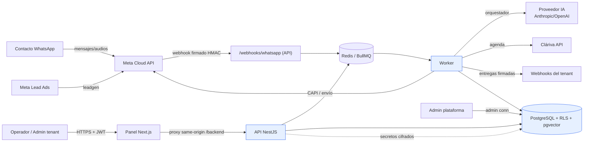

# Modelo de amenazas — Conversia

Metodología: STRIDE sobre los flujos de datos principales. Alcance: plataforma SaaS multi-tenant (WhatsApp + agentes IA + workflows + integraciones Meta/Cláriva). Actualizado 2026-07-26.

> No se declara seguridad absoluta. Este documento prioriza y da trazabilidad; los controles y su estado real están en [SECURITY_STATUS.md](SECURITY_STATUS.md) y [RISK_REGISTER.md](RISK_REGISTER.md).

## Diagrama de flujo de datos (nivel 1)

**Límites de confianza:** (1) Internet ↔ API/Webhook; (2) API ↔ BD (rol de app con RLS vs. rol admin); (3) Plataforma ↔ tenant; (4) tenant ↔ tenant; (5) Conversia ↔ proveedores externos (Meta/Cláriva/IA); (6) instrucciones confiables ↔ contenido no confiable (agentes IA).

## STRIDE por componente (resumen)

| Componente | S | T | R | I | D | E |
|---|---|---|---|---|---|---|
| Auth/Sesión | credential stuffing, robo de token | manipular claims JWT | — | enumeración de usuarios | fuerza bruta | escalar rol via token |
| API multi-tenant | — | mass assignment | falta de auditoría | **BOLA/IDOR cross-tenant** | consumo ilimitado | BFLA (función admin) |
| Base de datos | — | — | logs alterados | **fuga cross-tenant (RLS)** | consultas costosas | rol app con privilegios |
| Agentes IA | simular admin en el prompt | envenenar KB/RAG | — | exfiltración de datos/secretos, cross-tenant | **consumo ilimitado (costo)** | ejecutar tools no autorizadas |
| Webhooks entrantes | falsificar Meta | replay | — | — | flood | — |
| Webhooks salientes | — | — | — | **SSRF** a red interna | respuestas gigantes | — |
| Integraciones/secretos | robo de token Meta | — | — | fuga de credenciales | — | — |
| Archivos (futuro) | — | malware, zip bomb | — | path traversal | — | ejecución |

## Amenazas priorizadas y su tratamiento

| ID | Amenaza (STRIDE) | Prioridad | Control principal | Estado |
|---|---|---|---|---|
| T-01 | Acceso cruzado entre tenants (I/E — BOLA) | P0 | RLS Postgres + `withTenant` + verificador 19 pruebas + sondeo API 404 | Mitigado y probado |
| T-02 | Fuga de RLS por rol con privilegios (E) | P0 | Cliente dual: rol `conversia_app` sin BYPASSRLS para datos de tenant | Mitigado y probado |
| T-03 | Credential stuffing / fuerza bruta (D/S) | P1 | Rate limit por email (login) + por usuario (API) | Mitigado (borde IP pendiente) |
| T-04 | Algorithm confusion / token forjado (T) | P1 | JWT HS256 fijo + iss/aud + jti | Mitigado y probado |
| T-05 | Consumo ilimitado de IA / costo (D — LLM10) | P1 | Kill switch global+tenant + tope diario de tokens | Mitigado |
| T-06 | SSRF vía webhooks configurables (I) | P1 | Guard SSRF (bloqueo privadas/loopback/interno) + tests | Mitigado (DNS rebinding pendiente) |
| T-07 | Webhook Meta falsificado / replay (S/T) | P1 | Firma HMAC-SHA256 obligatoria; mock exige token | Mitigado (ventana timestamp pendiente) |
| T-08 | Inyección indirecta de prompt (I — LLM01) | P1 | Sanitización de variables + separación instrucción/contenido (history en rol user) | Parcial |
| T-09 | Fuga de secretos de integración (I) | P1 | AES-256-GCM en reposo, enmascarado en UI, nunca al frontend | Mitigado |
| T-10 | Enumeración de usuarios (I) | P2 | Mensajes genéricos + rate limit | Mitigado |
| T-11 | Stack traces / detalle interno en errores (I) | P2 | Filtro global: 500 opaco con errorId | Mitigado |
| T-12 | Clickjacking / MIME sniffing (varios) | P2 | Cabeceras (CSP, HSTS, X-CTO, frame-ancestors) | Mitigado |
| T-13 | Ejecución de código en workflows (E) | P1 | Motor sin eval; nodos tipados con zod; sin `call_api` habilitado | Mitigado (por diseño) |
| T-14 | Robo de cuenta admin sin MFA (S) | P1 | — | **Pendiente (MFA)** |
| T-15 | Malware en archivos (T) | P1 | — | **N/A: no existe carga de archivos aún** |
| T-16 | Dependencias comprometidas (cadena) | P1 | Lockfile + CI: gitleaks, pnpm audit, CodeQL, SBOM | Mitigado (parcial) |
| T-17 | Revocación de sesión / logout global (S) | P2 | — | **Pendiente (tokenVersion)** |
| T-18 | Backups inaccesibles / ransomware (D) | P1 | Backups gestionados Railway | **Requiere prueba de restauración** |

Los P0/P1 abiertos (MFA, DNS rebinding, ventana de timestamp en webhooks, revocación) están en [SECURITY_ROADMAP.md](SECURITY_ROADMAP.md).
